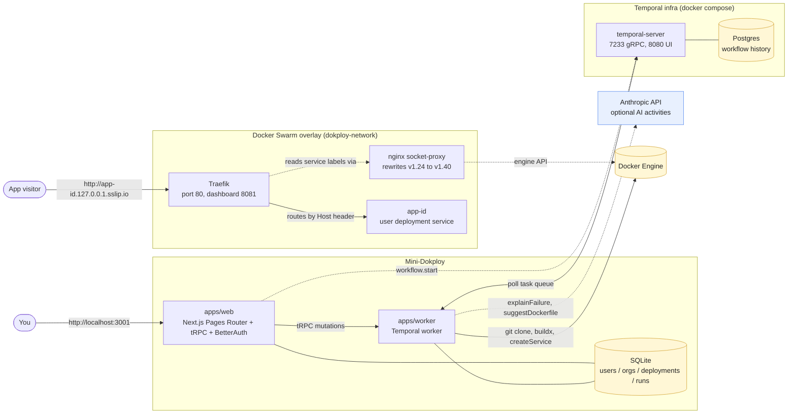

# Mini-Dokploy

A tiny Dokploy clone: paste a Git URL + Dockerfile path, get back a reachable
URL on `app-<id>.127.0.0.1.sslip.io`. Everything runs locally on Docker
Swarm + Traefik + Temporal, wired through a Next.js (Pages Router) + tRPC UI.

Plan and trade-offs are in [`docs/PLAN.md`](./docs/PLAN.md).

## System at a glance



<details><summary>Mermaid source</summary>



</details>

Key flows:
- **You create a deployment** → tRPC mutation writes the row → starts a Temporal workflow → worker picks it up → `gitClone → dockerBuild → dockerDeploy` activities → Swarm runs a new `app-<id>` service with Traefik labels.
- **A visitor hits the URL** → Traefik (Swarm service, port 80) matches the `Host: app-<id>.127.0.0.1.sslip.io` header → forwards to the user's container on the overlay network. No restart, no DNS, no config files.
- **Mini-Dokploy state lives in SQLite**; **Temporal's workflow history lives in Postgres**. They're separate on purpose — Temporal owns retries/replay; SQLite is the source of truth for "what the user sees".

---

## Setup

### Prerequisites

- macOS or Linux
- **Docker Desktop running** (4.30+ recommended; engine 25+)
- Node 22+
- pnpm 10 (install via `corepack enable && corepack prepare pnpm@10.18.3 --activate`)

### Two-command boot

```sh
pnpm install
pnpm dev
```

That's it. `pnpm dev` is wrapped by `scripts/bootstrap.sh`, which is fully
idempotent and:

1. Verifies the Docker daemon is reachable (fails fast with a clear message if not).
2. Generates `.env` from `.env.example` with a fresh `BETTER_AUTH_SECRET` if missing.
3. Initialises Docker Swarm (single-node) + two overlay networks.
4. Brings up Temporal (Postgres + temporal-server + UI) via `docker compose` and waits for `tctl cluster health` to pass.
5. Deploys Traefik + an nginx socket-proxy (rewrites the legacy Docker API path that recent engines reject) as Swarm services.
6. Applies Drizzle migrations against `./local.db`.

Then `turbo dev` runs `apps/web` (Next.js dev server) and `apps/worker`
(Temporal worker) together with hot reload.

When it finishes you should see:

| URL | What |
|-----|------|
| <http://localhost:3001> | Mini-Dokploy UI |
| <http://localhost:8080> | Temporal UI (workflow history, event log, retries) |
| <http://localhost:8081/dashboard/> | Traefik dashboard (live routers + services) |

### First-time deploy — `welcome-to-docker`

A 60-second smoke walkthrough. Use these **exact values** the first time so
you can see all features working before customising.

1. Visit <http://localhost:3001>. You'll be redirected to **Sign Up**.
2. Sign up with any email + password (BetterAuth keeps it local in SQLite).
3. You land on `/organizations`. Create an organization:
   - Name: `Acme`
   - Slug: `acme`
   - Click **Create organization**. It auto-activates with an "Active" marker.
4. Click **Deployments** in the header, then **New deployment**, and fill in:

   | Field | Value |
   |---|---|
   | Name | `welcome-to-docker` |
   | Git repository URL | `https://github.com/docker/welcome-to-docker` |
   | Branch | `main` |
   | Dockerfile path | `Dockerfile` |
   | Exposed port | `3000` |
   | Custom Docker labels | leave as `{}` |

   *(If `ANTHROPIC_API_KEY` is set, click the **AI auto-detect** button next to the URL — it will fill the last 3 fields for you.)*

   Click **Deploy**.

5. You're redirected to `/deployments/<id>`. Status polls every 3s and walks:
   `pending → building → deploying → running` (~60-90s warm / ~2min cold).
6. While it builds, open <http://localhost:8080> → **Workflows** → click the
   one whose Workflow ID matches the `runId` shown on your detail page.
   You'll see each activity start/complete with payloads and retries.
7. When the status flips to `running`, click the URL link
   (`http://app-<id>.127.0.0.1.sslip.io`). The Docker welcome React app loads.

### Try redeploy + destroy

From `/deployments/[id]`:
- **Redeploy** → re-runs the full workflow with the same params and reuses the same hostname (zero downtime via Swarm `start-first`).
- **Destroy** → removes the Swarm service (URL returns 404) and soft-deletes the row.

### Daily commands

```sh
pnpm dev               # boot everything, two-command start
pnpm temporal:down     # stop Temporal infra (Swarm + Traefik survive)
pnpm stack:down        # full teardown (Swarm services + Temporal)
pnpm db:studio         # open Drizzle Studio against ./local.db
```

### Optional: AI features

Paste your Anthropic key into `.env`:

```sh
echo "ANTHROPIC_API_KEY=sk-ant-..." >> .env  # if not already there
# Ctrl-C the running pnpm dev and re-run:
pnpm dev
# Verify:
curl http://localhost:3001/api/trpc/ai.available
# expected: {"result":{"data":{"available":true}}}
```

Activates: **AI auto-detect** button on `/deployments/new` + AI failure
explainer (the `deployment_run.failureReason` column gets a 1-paragraph
plain-English summary instead of the raw error).

### Tests

```sh
pnpm -F @mini-dokploy/core test     # 10 unit tests (Traefik label tenant-hijack)
pnpm test:e2e                       # Playwright smoke (auth + org + UI). ~13s.
pnpm test:e2e:full                  # Full Playwright deploy lifecycle. Needs `pnpm stack:up`.
```

### Production-mode (everything as Swarm services)

`pnpm dev` runs the app + worker natively for hot reload. To run **everything**
as Docker Swarm services (mini-dokploy web + worker + Traefik + user
deployments — no native processes):

```sh
pnpm stack:up         # builds mini-dokploy/web + worker images, deploys the Swarm stack
# UI now at:  http://dokploy.127.0.0.1.sslip.io
pnpm stack:down       # tear down
```

### Troubleshooting

| Symptom | Likely fix |
|---|---|
| `pnpm dev` says "Docker daemon is not reachable" | Start Docker Desktop. On macOS: `open -a Docker`. |
| `EADDRINUSE :::3001` | A stray Next dev server is holding the port. `kill $(lsof -ti tcp:3001)`. |
| Deployment status stuck on `failed` | Open `/deployments/[id]`, read **failureReason** in the run history. If `Remote branch <X> not found in upstream origin`, the repo's default branch isn't `main` — set it explicitly (most older repos use `master`). |
| 404 on `app-<id>.127.0.0.1.sslip.io` | Traefik hasn't picked up the router yet. Check <http://localhost:8081/api/http/routers> — should list `app-<id>@swarm`. If missing, `docker service logs dokploy-traefik`. |
| Worker logs `TransportError: Failed to call GetSystemInfo` | Temporal isn't reachable at `localhost:7233`. `docker ps \| grep temporal` — restart compose if missing. |

Interactive driving (Claude users): the `agent-browser` skill can pilot the
UI without writing test code — useful for demos. Not wired into `pnpm test`.

---

## Architecture

```
┌───────────────────────────────────────────────────────────────┐
│  Browser → http://app-<id>.127.0.0.1.sslip.io                 │
└──────────────────────────┬────────────────────────────────────┘
                           ▼
┌───────────────────────────────────────────────────────────────┐
│  Traefik (Swarm service, port 80 host mode)                   │
│   reads service-level labels via the Swarm provider           │
└────────┬─────────────────────────────────┬────────────────────┘
         ▼                                 ▼
┌──────────────────┐               ┌──────────────────────────┐
│ dokploy_web      │               │ app-<id> (user deploy)   │
│ Next.js Pages    │               │ Built from user's repo   │
│ tRPC + BetterAuth│               │ Swarm replicated service │
└────────┬─────────┘               └──────────────────────────┘
         │ writes deployment row
         │ + starts Temporal workflow
         ▼
┌──────────────────┐         ┌──────────────────────────────────┐
│ dokploy_worker   │ ──────► │ Temporal cluster                 │
│ Temporal worker  │ polls   │  PostgreSQL persistence          │
│ runs activities  │ Task Q  │  UI at :8080                     │
└────────┬─────────┘         └──────────────────────────────────┘
         │
         ├── git clone (simple-git, shallow)
         ├── docker buildx build --load
         ├── dockerode createService / update (in place, start-first)
         └── Vercel AI SDK (Claude) for failure explanations + repo introspection
```

Key boundaries:

- **`packages/core`** — pure, zero-I/O: hardened Traefik labels, deployment
  schemas, status state machine, ID helpers. Imported by everyone.
- **`packages/ai`** — Vercel AI SDK wrappers (Anthropic). Importable from
  both web (tRPC routers) and worker (activities) because it has no
  dockerode/git deps.
- **`packages/orchestrator`** — worker-only: dockerode, simple-git, buildx
  wrapper, log writers. `packages/api` never imports this.
- **`packages/workflow-client`** — thin `@temporalio/client` wrapper used by
  tRPC mutations to start workflows. The only Temporal touchpoint in web.
- **`packages/api`** — tRPC routers. Imports `core`, `workflow-client`, `ai`.
- **`packages/db`** — SQLite + Drizzle. Only needs `DATABASE_URL` (no
  BetterAuth env vars), so the worker can use it without inheriting web's
  auth requirements.
- **`packages/auth`** — BetterAuth + organization plugin (multi-tenant).
- **`apps/web`** — Pages Router. tRPC adapter at `/api/trpc/[trpc]`, auth at
  `/api/auth/[...all]`, WebSocket log stream at `/api/ws/logs/[runId]`.
- **`apps/worker`** — `@temporalio/worker` bootstrap + activities. Activities
  delegate to `orchestrator`/`ai`/`db`.

Two overlay networks (created by `scripts/network-up.sh`, attachable so plain
compose can join them too):

- `dokploy-network` — Traefik, web, worker, all `app-*` user services.
- `temporal-network` — Temporal cluster + Postgres + UI, **plus** web and
  worker (they need to reach `temporal:7233`).

---

## Tradeoffs and future work

**Done deliberately, not by accident:**

- **Pages Router** (the brief required it). The Better-T-Stack scaffold
  started on App Router; the migration covered the tRPC adapter, the
  BetterAuth handler, and the trpc/next client together as one bundle.
- **Hybrid orchestration**: plain `docker compose` for Temporal infra (the
  upstream layout is battle-tested with this) and Docker Swarm for Mini-
  Dokploy itself + user deployments. The brief mandated "Docker services,
  not docker run / not plain compose" for the product surface; Temporal is
  internal infrastructure, not a product service. Both networks are
  attachable overlays so the world is internally coherent.
- **Migrations on web boot**, not on host. The SQLite file lives on the
  `dokploy-data` Swarm volume; running migrations on the host would target
  the dev DB and leave the container's DB unmigrated.
- **`packages/core` is pure**. The hardened Traefik label filter sits there
  with 10 vitest cases (tenant hijack, cross-deployment overrides, port
  rebinding all rejected).
- **Single-replica web + worker**, so the file-tailed WebSocket logs and the
  shared SQLite file work without Redis pub/sub or libsql-server.

**Future work** (cut list from `docs/PLAN.md` §16):

- **Multi-replica logs**: Redis pub/sub keyed by `runId` so any web replica
  can serve the stream.
- **Private registry** in the Swarm stack so multi-node deployments can
  schedule on workers (the current design assumes a single-node manager).
- **BuildKit cache mount** in the worker to drastically speed up Docker
  builds across redeploys.
- **More builders** beyond Dockerfile (nixpacks, buildpacks) — mirrors the
  reference Dokploy.
- **Real reconciliation** beyond the narrow "DB row inserted but
  workflow.start threw" race that is currently handled.
- **OAuth providers** in BetterAuth (GitHub, Google) + invitation emails.
- **Per-deployment first-class middlewares** field (rate limit, basic auth,
  IP allowlist) that maps to namespaced Traefik labels — safer than the
  free-form `customLabels` JSON.

---

## AI tooling usage

**Used Claude (this repo was built with Claude Code):**

- Drafting and reviewing the implementation plan in `docs/PLAN.md`. The
  plan went through the bundled `/seldon` skill twice as an independent
  reviewer; each pass surfaced concrete architectural gaps (network model,
  scope, package boundaries, migration strategy) that shaped the final
  layout.
- Generating boilerplate for the new packages (`core`, `ai`, `orchestrator`,
  `workflow-client`, `worker`) — TypeScript scaffolding is repetitive and AI
  delivers it faster than a snippet library.
- Writing the hardened Traefik label filter and its tenant-hijack test
  cases. The `/traefik` skill was the source of truth; the function was
  copied near-verbatim because the threat model is load-bearing.
- Wiring the Pages Router migration as a single coordinated change (tRPC
  adapter swap + BetterAuth handler + context signature + `_app.tsx`).

**Did not use AI for:**

- Picking technical direction. The plan emerged from a back-and-forth about
  real trade-offs (router choice, DB choice, AI scope, orchestration
  model). The AI helped articulate options; the human made the calls.
- The `docker-compose.yml` Temporal layout. That came from the upstream
  Temporal docker-compose repo, lightly adapted (named volume, overlay
  network, dynamic config path).
- The DNS-safe ID strategy (`nanoid` with lowercase-alphanumeric alphabet).
  Standard practice, no AI needed.
- The Pages-Router-specific BetterAuth handler (`toNodeHandler` +
  `config.api.bodyParser = false`). That comes straight from BetterAuth's
  docs.

The prompts and conversational history (including each rejected plan
revision) are in the commit log of this repo for the deeper trail.
